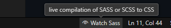

# Instrucciones para compilación

Instalar <a href="https://marketplace.visualstudio.com/items?itemName=glenn2223.live-sass">Live Sass Compiler</a> para VSCode

El archivo principal es:

```
tecya-styles/style.scss
```

Mantener activada opción para auto compilar



Cada cambio hecho en `style.scss` se verá reflejado en archivo a utilizar:

```
tecya-styles/style.css
```

**Esperar cambios fuertes en la estructura de este proyecto.**